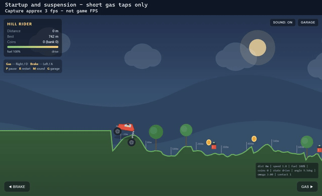

# Qwen3.8-Flash-Next 125B on RTX 4090 with Strata — 166 tok/s, failed game prototype

**An independent, single-run coding experiment:** can a large local model build a playable hill-climbing game using Strata on one 24 GB GPU?

**Result: the game-quality goal failed.** The code launches and some mechanics work, but the owner rejected the result: poor vehicle physics and game feel. Earlier wording called this a “playable small prototype”; that overstated the outcome. Running without a blank screen is not the same as delivering an acceptable game.

[Inspect the failed prototype](https://darkerow.github.io/strata-qwen-hillclimb-benchmark/game/) · [Live report / Русский отчёт](https://darkerow.github.io/strata-qwen-hillclimb-benchmark/) · [Game source](game/) · [Download game ZIP](https://darkerow.github.io/strata-qwen-hillclimb-benchmark/strata-hillclimb.zip) · [Exact prompt](prompt.txt) · [Raw metrics](evidence/metrics.json)

[](https://darkerow.github.io/strata-qwen-hillclimb-benchmark/media/startup-capture.mp4)

**16-second startup/suspension capture, not a full drive.** Short gas taps only; the capture is about 3 fps, not a measurement of game FPS. [MP4](media/startup-capture.mp4) · [Capture details](media/README.txt)

**Scope:** one assisted run, IQ2_XS quantization, reasoning off in the main run. This does not establish the quality of the full-precision model or Strata generally.

## Measured results — 1 October 2026

| Metric | Result |
|---|---:|
| Model | Qwen3.8-Flash-Next IQ2_XS, original model, not Swift/Coder |
| Runtime | Strata, pinned commit `30ec18ec7094550fcc594fd948220d511d80464e` |
| Hardware | RTX 4090 24 GB, 16 vCPU (Xeon Granite Rapids / AVX512), 64 GB RAM, 160 GB SSD |
| Context / KV | 65,536 tokens; INT8 KV; 32,768 GPU-resident tokens |
| Speculation | MTP, draft 4, minimum probability 0.5; 84.9% draft acceptance |
| Main run | reasoning `none`, temperature 0.7, top_p 0.95; speed projection disabled |
| Weighted generation rate | **166.36 output tokens/s** |
| Mean API response latency | **3.59 s**, including many tiny tool calls |
| Main-run responses / browser-check rounds | **80 / 7** |
| Main-run output tokens | 37,449 |
| Input tokens summed across requests | 2,700,168; 2,640,287 reported cached |
| Main-run harness elapsed time | 765.89 s (12.8 min), including test waits; excludes gaps between runner restarts |
| Setup, compilation and download | 1,156.09 s (19 min 16 s) |
| Peak sampled GPU memory | 23,918 MiB (23.36 GiB) |
| VM lifetime | approximately 39 min; deleted after the test |
| Observed bill | 59.87 RUB, excluding the last unbilled disk interval |

The model also uses CPU, RAM and SSD. **These results are not evidence that all model weights fit in 24 GB VRAM.** Performance depends on the whole machine and this prompt. No comparison with other GPUs, quantizations or runtimes was run here.

Generation rate is `sum(completion_tokens) / sum(timings.predicted_ms / 1000)`. Response latency includes prompt processing and request overhead. Neither figure is game-development speed. Input totals repeatedly count conversation history; they are not unique tokens or a measure of paid Codex savings.

## What the model actually did

The model wrote every game file through an external Python tool loop: `write_file`, `read_file`, `replace_text`, `syntax_check`, `browser_check`, `finish`. The coordinator supplied tools and test observations and repaired the harness's context management; it did not edit the game code.

`browser_check` was **not a built-in Strata browser agent**. A coordinator inspected the real browser and returned text observations. Long driving tests executed the unchanged game in a Node VM with a fake DOM and simulated held keys. The model did not receive screenshots as vision input. This is an assisted coding experiment, not proof of fully autonomous development.

Final 120-second simulated gas-hold test: **1,429 m, 7 coins banked, fuel pickups, then game over when fuel ran out**. Rendering, Start, garage and pause were checked in a real browser. Upgrade purchases, mobile controls, rollover failure and long-term persistence were not exhaustively tested.

### Failures and caveats

- First attempt with reasoning `medium`: 16,000 output tokens in 107.66 s, no created files. A subsequent request was interrupted at the client; its complete usage is not in the aggregate. See `evidence/attempt-medium/`.
- Early game versions omitted angular integration, so the body stayed horizontal. A later patch introduced `NaN` velocity. Both were corrected after test feedback.
- Two HTTP 400 errors came from the harness/context budget. Output allowance changed from 16,000 to 8,192; later, current files and recent observations were carried into fresh context. These failures should not be attributed solely to the model.
- The final ride remains springy, with implausible body angles. The owner rejected the game quality. Earlier numerical scores were withdrawn because there was no justified scoring rubric.
- The game-over screen displays zero run coins even though the bank receives them. Collectibles are generated only to 4,200 world units.
- `conversation.json` is the final retained context after compaction, **not the entire session**. Per-turn responses, actions and browser feedback preserve additional history. Interrupted response data and intermediate pre-edit versions of the harness were not all captured.

## Inspect locally

Requires Python 3 only for serving static files:

```sh
python -m http.server 8000 --bind 127.0.0.1
```

Open `http://127.0.0.1:8000/game/` for the game or `/` for the Russian report.

Controls: **Right/D** gas, **Left/A** brake, **P** pause, **R** restart, **G** garage, **M** sound. There are on-screen pedals. No build step, external assets or JavaScript dependencies.

## Audit and reproduce

1. Read the [Strata repository](https://github.com/Niko1221/Strata) and [model card](https://huggingface.co/Qwen/Qwen3.8-Flash-Next). This repository does not redistribute model weights or the Strata engine.
2. `tools/setup-observed.sh` records the setup commands used on the disposable Ubuntu VM; inspect paths and system-package installation before using it. It is a historical script, not a portable installer. Runtime arguments are in `evidence/runtime-config.json`; `<STRATA_WORKDIR>` replaces the original installation root.
3. Run Strata separately. To start a new generation session without touching the archived game:

   ```sh
   python tools/run_agent.py --endpoint http://127.0.0.1:8080/v1/chat/completions --output runs/local --minutes 15
   ```

   Python 3 and Node.js are required. This portable runner is adapted from the final observed harness and has not been rerun against the rented model. It defaults to the final 8,192-token response allowance, so it does not exactly repeat the initial phase. `tools/runner-observed.py` preserves the final harness version used in the test.

4. When `browser-request.json` appears, independently inspect the generated game and write honest observations as valid JSON to `browser-response-N.json` in the same run folder (`N` is the request ID). Do not reuse this test's feedback for a new run. No browser automation is bundled in the runner. Its timeout stops client work; **it does not delete or stop a rented server**.
5. Replay the non-rendering physics test:

   ```sh
   node tools/physics-harness.cjs game mainbtn 24
   python tools/verify.py
   ```

Exact output may vary by sampling, dependencies and hardware. The fake DOM is intentionally limited and does not prove that all browser features work.

## Repository contents

- `game/`: unchanged final model-generated source and Russian controls/readme.
- `prompt.txt`: exact initial task; system instruction and schemas are preserved in the runner.
- `evidence/responses/`: 80 API responses, including generated tool calls.
- `evidence/actions.json`: tool arguments and outcomes.
- `evidence/browser-feedback/`: all seven feedback rounds, including coordinator guidance.
- `evidence/physics-history/`, `physics-final.json`: intermediate failures and final measurements.
- `evidence/attempt-medium/`: captured failed reasoning attempt.
- `evidence/metrics.json`, `gpu-telemetry.csv`: timings, token counts and sampled GPU usage.
- `summary.json`, `index.html`: readable results and limitations.
- `MANIFEST.sha256`: file integrity hashes.

Account screenshots, credentials, server IPs, billing identifiers and private account logs are excluded. Game files are byte-for-byte copies of the measured final output.

## Hosted result

The report and unchanged prototype are hosted on GitHub Pages (main branch, root). No GPU or backend is needed to inspect the output.

## Assessment correction

The current README, report and summary supersede the initial editorial verdict in `evidence/evaluation.json`. That archived file and the model’s own completion claims are retained as historical evidence, not endorsements of game quality. Game source, prompts, API responses and measured timings are unchanged.

This is an independent experiment, not an official Strata or Qwen benchmark. Hill Climb Racing is referenced as gameplay inspiration; the generated game uses its own drawn assets.
